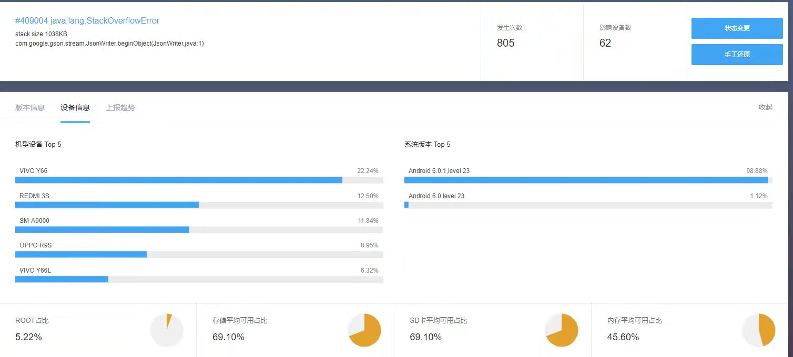

# HighAndroid
Android进阶Demo【HenCoder 第八期】

### 技术点应用
* [图形的位置和尺寸测量](path)
* [文本绘制](text)
* [View的测量和布局](customlayout)
* [View touch](touch)
* [范围裁切和几何变换](clipcamera)
* [属性动画应用](animation)
* [手动打包简单APK流程](buildapk)
* [简单插件化和热更新](component)
* [简易Android Processor使用](butterknife)
* [RecyclerView部分解析](source/RecyclerView)
* [Retrofit协程不使用Result处理异常的一种CallAdapter](source/retrofit)

### 问题查找过程
* [打包后资源文件变为\<x />](question/shrink)
    

         
        
    

* [关于ConstraintLayout中TextView省略号问题](constraint)
    

         
        
        
    

* [关于 Activity/Fragment.SharedElement 过渡相关问题](fragment)
    

         
        
        
    

* [关于系统恢复ViewPager导致Framgent不一致问题](question/recovery)
    

         
        
        
    

* [关于Android6.0-gson-StackOverflowError问题](question/android6/gson)
    

         
        
    

