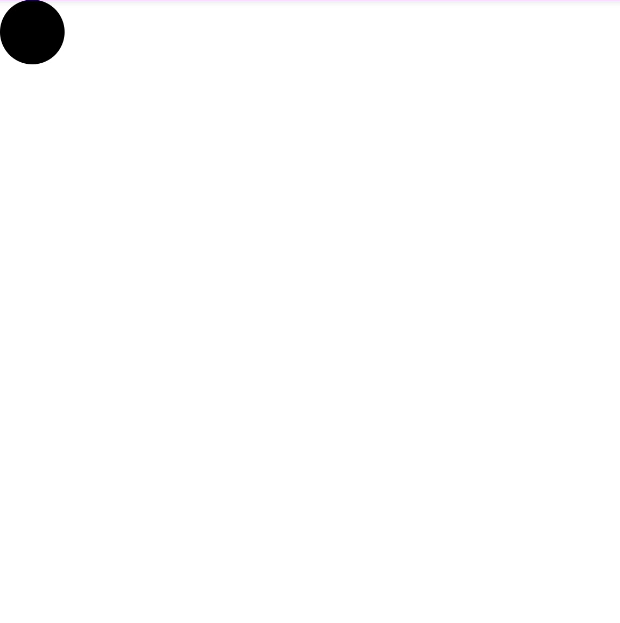
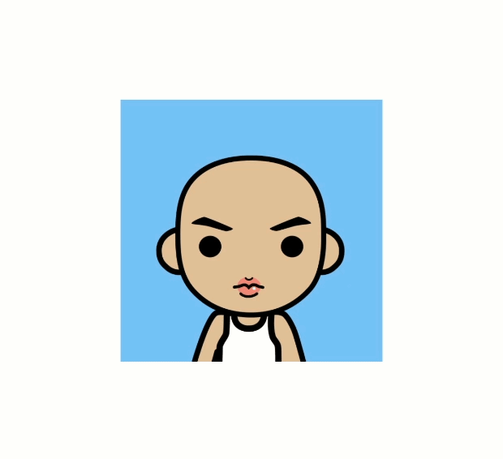

# 属性动画

### [CircleView](./src/main/java/com/zxj/animation/view/CircleView.kt)
属性动画最简单的使用

### [PointView](./src/main/java/com/zxj/animation/view/PointView.kt)
PointF估值器

### [CameraView](./src/main/java/com/zxj/animation/view/CameraView.kt)
android.graphics.Camera 的使用

### [ProvinceView](./src/main/java/com/zxj/animation/view/ProvinceView.kt)
字符串估值器

