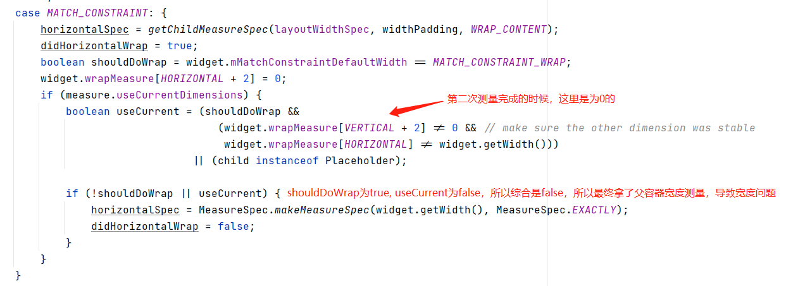

  <!-- 动态图1 -->
  
  <!-- 动态图2 -->
  

问题的由来，是在HencoderPlus听 ConstraintLayout 课程的时候，模仿了下高老师的效果，然后发现我写的并不能出现省略号，然后我就调呀调，调呀调。最后调出来了,当把黄色背景的 TextView 的高度设为android:layout_height="wrap_content"的时候，就可以正常显示了，但为什么呢？？？
 
 

首先我先弄了个 LinearLayout 套 TextView，然后给此 TextView 设置成[ match_parent || wrap_content || 固定值 ]，都是可以正常显示的省略号的，那么可以确定是 ConstraintLayout 原因了
 
 

然后在翻查 ConstraintLayout 代码的时候，发现有个另外一个方法 forceLayout，这个方法跟 requestLayout 一样，是用来标记此view需要重新布局的，但是有个区别是，forceLayout 只用来标记，不会向 父view传递，则只是用来标记的；这个用法，我猜测是，操控指定的子view刷新而不刷新全部子view，做一些精细化的控制；因为关于 forceLayout 资料其实蛮少的。
 
 

ConstraintLayout 的测量中，其实有四种测量模式，分别是【ConstraintWidget.DimensionBehaviour类中的FIXED, WRAP_CONTENT, MATCH_CONSTRAINT, MATCH_PARENT】，以宽度为例，以为由下面的六种模式转换而来的：
<ul>
  <li>当 android:layout_width="100dp" 的时候，此时为固定值,对于 view 的 ConstraintWidget 中标记此模式为 ConstraintWidget.DimensionBehaviour.FIXED</li>
  <li>当 android:layout_width="0dp" 的时候，对于 view 的 ConstraintWidget 中标记此模式为 ConstraintWidget.DimensionBehaviour.MATCH_CONSTRAINT</li>     
  <li>当 android:layout_width="wrap_content" 和 app:layout_constrainedWidth="false" 的时候，对于 view 的 ConstraintWidget 中标记此模式ConstraintWidget.DimensionBehaviour.WRAP_CONTENT</li>
  <li>当 android:layout_width="wrap_content" 和 app:layout_constrainedWidth="true" 的时候，对于 view 的 ConstraintWidget 中标记此模式为 ConstraintWidget.DimensionBehaviour.MATCH_CONSTRAINT</li>
  <li>当 android:layout_width="match_parent" 和 app:layout_constrainedWidth="true" 的时候，对于 view 的 ConstraintWidget 中标记此模式为 ConstraintWidget.DimensionBehaviour.MATCH_CONSTRAINT </li>
  <li>当 android:layout_width="match_parent" 和 app:layout_constrainedWidth="false" 的时候，对于 view 的 ConstraintWidget 中标记此模式为 ConstraintWidget.DimensionBehaviour.MATCH_PARENT  </li>
</ul>

 
 
BasicMeasure[真正的测量调度类]，对于可变的尺寸，测量最少为3次,
当widget的任意方向等于 ConstraintWidget.DimensionBehaviour.MATCH_CONSTRAINT 或者 ConstraintWidget.DimensionBehaviour.MATCH_PARENT的时候，就是称为可变尺寸[代码 BasicMeasure.updateHierarchy 中]
在 BasicMeasure.solverMeasure 中，首先会测量所有 子widget 的宽高，接下来在每一个可变控件中进行2次测量,
最后我通过TextView中的 layout.getEllipsizedWidth()，这个宽度不是目的宽度【A】，而是一个比目的宽度大的值【B】，然后再经过LinearSystem去矫正到目的宽度【A】，所以矫正的时候 TextView中的layout是无感知的，TextView以为还是B宽度，所以没有绘制省略号

 

实际出现问题的代码在 ConstraintLayout 中的 Measurer 内部类中，measure方法中  

而当高度设置为 android:layout_height="wrap_content"的时候，didVerticalWrap为true，widget.wrapMeasure[VERTICAL + 2] != 0，所以不会出现此情况第三次的时候使用父容器宽度测量 
其实出现问题的的本质是，measure TextView的宽度和 layout TextView的宽度不是同一个，而TextView的绘制文本的layout是在measure的时候就创建好了，layout的时候没有判断，省略号宽度和当前宽度比较

<!-- 解决方法 -->

<!-- Constraint主要继承图 -->

<!-- 测量 -->
