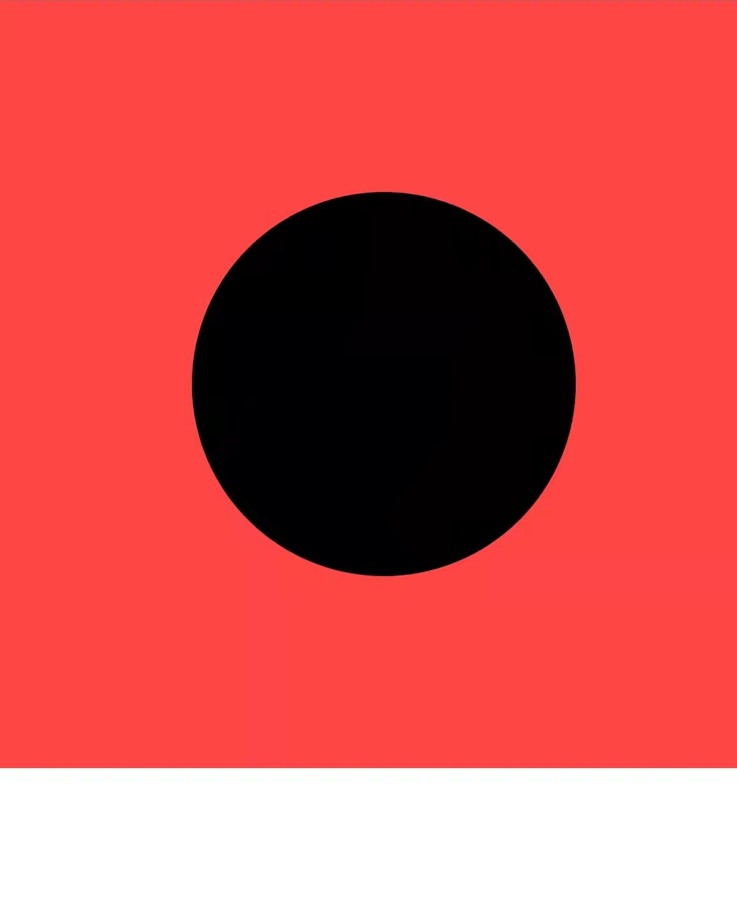
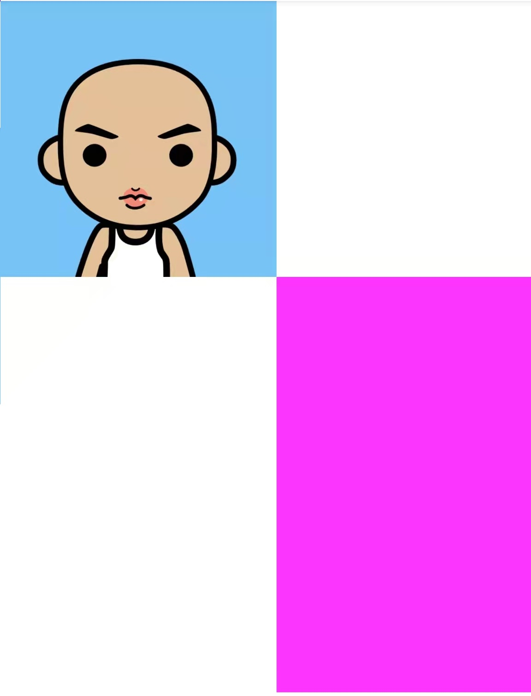
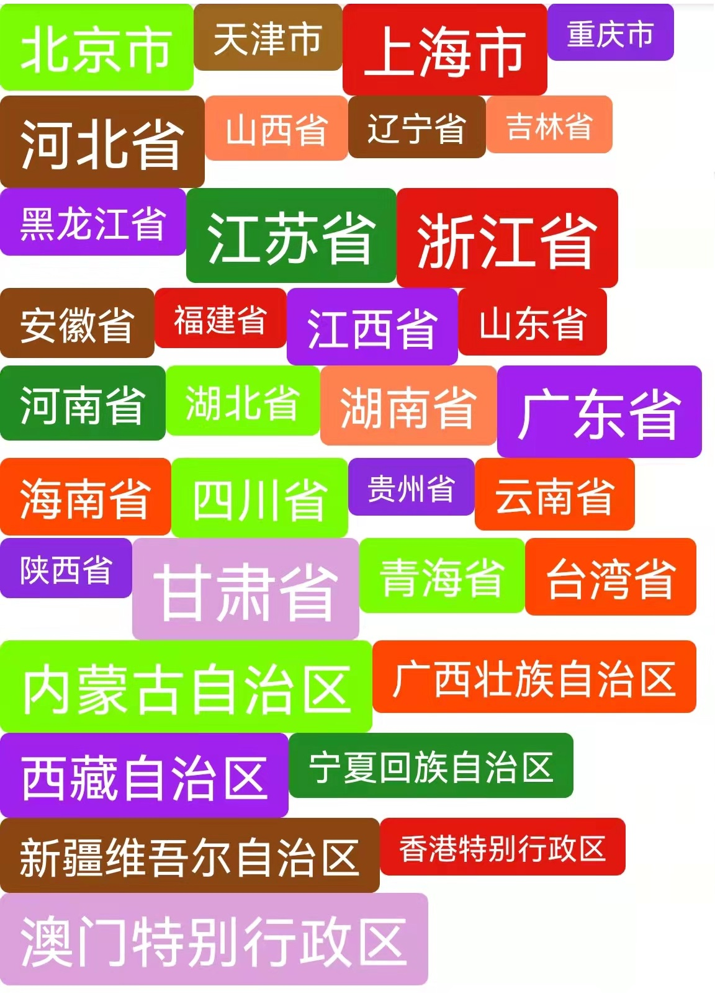

# View的测量和布局

### 自定义View
view的自身测量：
* mode == MeasureSpec.EXACTLY 的时候, 直接使用父布局分配的大小[因为当前MeasureSpec，是父布局根据自身和开发者定义的尺寸合并而得]
* mode == MeasureSpec.AT_MOST 的时候，根据当前实际的view大小和父类分配的大小，取最小值[定义此规则是开发者可以根据效果做调整，将可变基于开发者]
* mode == MeasureSpec.UNSPECIFIED 的时候，父布局对子view没有任何限制，一般取view实际使用的大小

[wrap_content处理示例:](./src/main/java/com/zxj/customlayout/view/CircleView.kt)

[正方形View处理示例:](./src/main/java/com/zxj/customlayout/view/SquareImageView.kt)

### 自定义ViewGroup
1. 自定义LayoutParams，在child view 加进 ViewGroup 的时候，会生成专属LayoutParams，可以指定布局参数
2. 根据自身 widthMeasureSpec、heightMeasureSpec 和 child view layoutParams 上的 width、height 生成 child widthMeasureSpec、heightMeasureSpec[下面以width举例]
   * width 设定为固定值的时候，直接生成 MeasureSpec.makeMeasureSpec(width, MeasureSpec.EXACTLY) 
   * width == MATCH_PARENT 的时候
     * parent.widthMeasureSpec == [EXACTLY + size] => child.widthMeasureSpec = [EXACTLY + parentSize]
     * parent.widthMeasureSpec == [AT_MOST + size] => child.widthMeasureSpec = [EXACTLY + parentSize]，凯老师说这里[AT_MOST + size]也可以，主要看怎么设计
     * parent.widthMeasureSpec == [UNSPECIFIED + 0] => child.widthMeasureSpec = [UNSPECIFIED + 0], 代表不限制child View
   * width == WARP_CONTENT 的时候
     * parent.widthMeasureSpec == [EXACTLY + size] => child.widthMeasureSpec = [AT_MOST + parentSize]
     * parent.widthMeasureSpec == [AT_MOST + size] => child.widthMeasureSpec = [AT_MOST + parentSize]
     * parent.widthMeasureSpec == [UNSPECIFIED + 0] => child.widthMeasureSpec = [UNSPECIFIED + 0], 代表不限制child View
3. 使用得到child widthMeasureSpec、heightMeasureSpec 进行child view测量
4. 根据布局算法和步骤3测量的数据进行layout过程

[自定义TabLayout示例:](./src/main/java/com/zxj/customlayout/viewgroup/TabLayout.kt)

