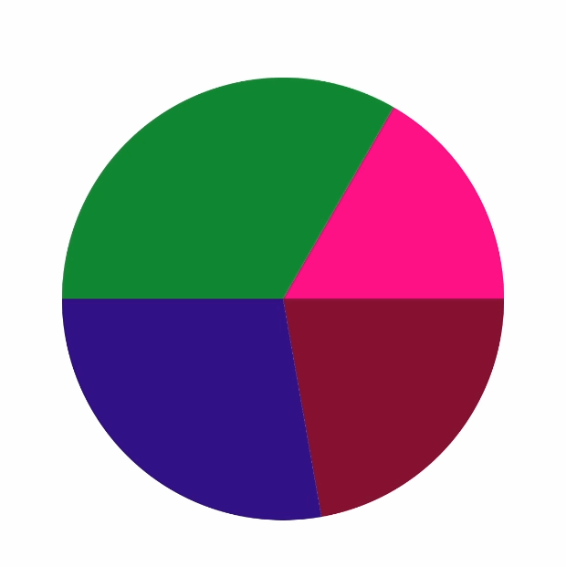

# 图形的位置和尺寸测量

### [饼图](src/main/java/com/zxj/path/custom/PieView.kt)

1. canvas.drawArc() 应用
2. canvas.translate() 应用

### [仪表盘](src/main/java/com/zxj/path/custom/DashboardView.kt)

1. PathMeasure 应用 => 测量弧形长度
2. PathDashPathEffect 应用 => 在制定路径上绘制PathDash
