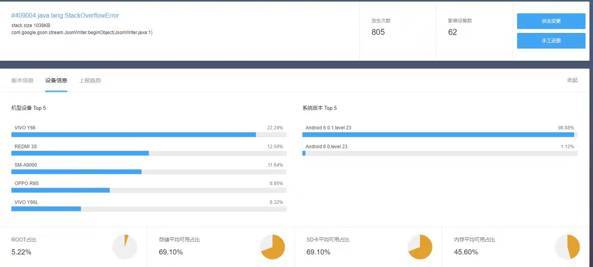

# 关于Android6.0-gson-StackOverflowError问题

### 问题起因

在观察腾讯Bugly线上bug的时候，发现一个只有android6.0才有的StackOverflowError



### 问题定位

* adb shell bugreport > [输出到指定路径]：获取系统运行日志，观察bug前后时间系统的行为
* 获取应用自身运行日志记录，观察bug前后时间应用的行为
* 结合bugly中的bug描述，最终将bug范围锁定在 gson 序列化 android.location.Address 的时候

### 问题本质

因为相同代码只有 android6.0 出现，观察 android6.0 的序列化堆栈

* 在 Android6.0 环境中

```java
public class Address implements Parcelable {
    // ...

    // step1: StackOverflowError 
    private Bundle mExtras = null;

    // ...
}

// step2: 主要是父类的BaseBundle
public final class Bundle extends BaseBundle implements Cloneable, Parcelable {
    // ... 
}

public class BaseBundle {
    // ...

    // step3: 主要是classLoader 
    private ClassLoader mClassLoader;

    //...
}

public abstract class ClassLoader {
    // ...

    // step4: 主要是Package
    private final HashMap<String, Package> packages = new HashMap<>();

    // ...
}

public class Package implements AnnotatedElement {
    // ...

    // step5: 主要是classLoader，发生了循环依赖
    private final ClassLoader classLoader;

    // ...
}

```

* 在 Android7.0 环境中

```java
public class Package implements java.lang.reflect.AnnotatedElement {
    // ...
    private transient final ClassLoader loader;
    // ...
}
```


### 问题结论
在 Android6.0 中，Package类中classLoader对象 和 ClassLoader类中package对象 相互依赖，最终造成 StackOverflowError

而在 Android7.0 中，google给予Package类中classLoader对象增加 transient 关键字，防止相互序列化，因为解决此问题

所以当apk要兼容 android6.0 的时候 且 需要序列化的时候，需要检查对象是否含有 Package 或者 ClassLoader

