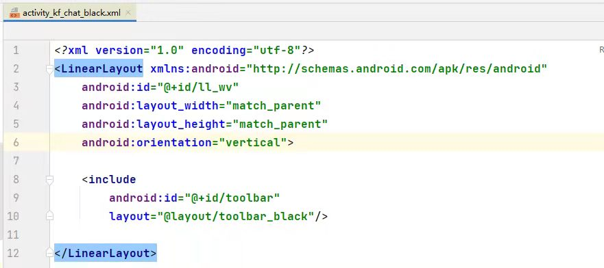
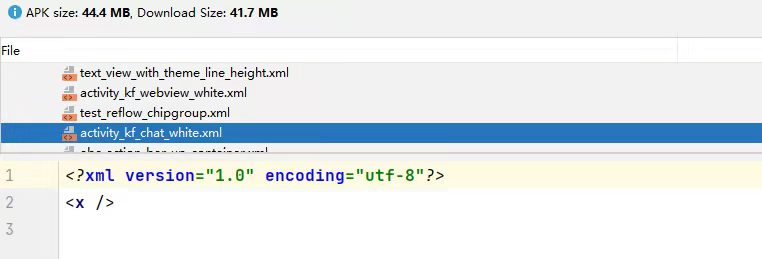
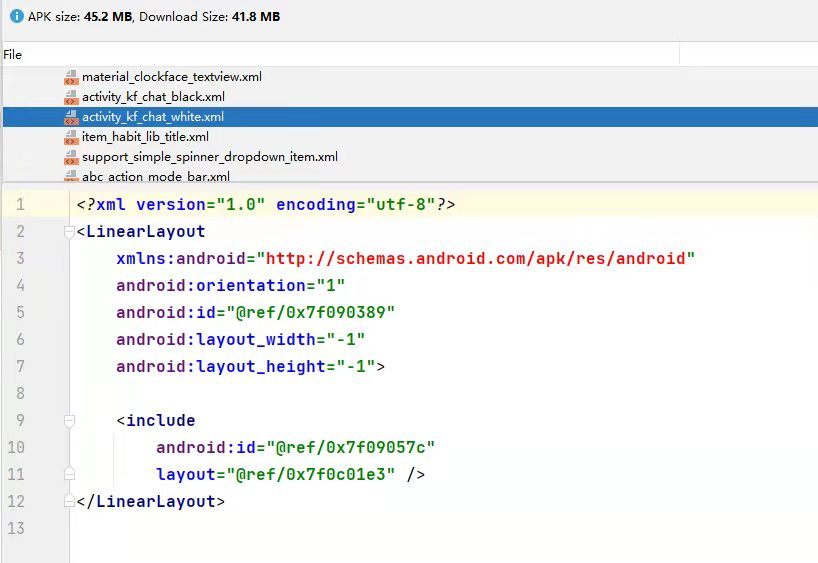

# ShrinkResources 相关问题

### 因反射资源导致问题

本问题基于 com.android.tools.build:gradle:4.1.2 版本，问题sdk为53客服

原文件



打包后的文件, 发现文件资源内容变为 \<x/>



经过官方文档修复后



### 解决方法

[官方文档](https://developer.android.com/studio/build/shrink-code?hl=zh-cn#keep-resources)有2种解决方式

1. 创建 res/raw/keep.xml 文件, 启用安全模式

```xml
<?xml version="1.0" encoding="utf-8"?>
<resources xmlns:tools="http://schemas.android.com/tools" tools:shrinkMode="safe" />
```

2. 创建 res/raw/keep.xml 文件, 手动编写保留文件

```xml
<?xml version="1.0" encoding="utf-8"?>
<resources xmlns:tools="http://schemas.android.com/tools"
    tools:keep="@layout/l_used*_c,@layout/l_used_a,@layout/l_used_b*"
    tools:discard="@layout/unused2" />
```

### 定位 \<x/> 发生的文件
1. 根据异常信息，可定位到 KFChatActivity 中的，反射 android.widget.x 控件异常
2. 继承 KFChatActivity, 重写 onCreateView 方法，对比 shrinkResources 开启和关闭的的View生成，可定位 activity_kf_chat_black.xml 文件问题
3. 查看生成后的shrink开启的apk资源文件 activity_kf_chat_black.xml，发现文件内容确实为\<x/>
4. 然后搜索 google shrink 和 xml 内容相关，可追踪到官方文档

### 查找替换为 \<x/> 过程
1. 利用 gradle 回调，获取当前打包所有任务，由上述可知 shrink 引起的过程，打印 assemble 过程的所有执行
```groovy
// 执行一次assemble*任务，查找当前Shrink相关内容
gradle.taskGraph.whenReady { taskGraph ->
    taskGraph.allTasks.each { task ->
        println "task = ${task.name}, class = ${task.class.toString() - "_Decorated"} , dependOns = ${task.dependsOn}"
     }
}
```
2. 从打印过程中搜索与Shrink相关的任务，发现 ShrinkResourcesTask 相关类，点击查找源码
3. 最后发现 ResourceShrinkerImpl.replaceWithDummyEntry()，使用固定bytes数组替换原先文件，并且从注释可知内容为\<x/>
4. 使用bytes数组拷贝，写进一个*.xml,并放入apk中，最后可查看到与问题相同的内容（因为这里内容是加密的，AndroidStudio打开apk的时候做了解密）
```java
class ResourceShrinkerImpl {
    
    // The XML document <x/> as binary-packed with AAPT
    public static final byte[] TINY_BINARY_XML =
            new byte[]{
                    (byte) 3, (byte) 0, (byte) 8, (byte) 0, (byte) 104, (byte) 0,
                    (byte) 0, (byte) 0, (byte) 1, (byte) 0, (byte) 28, (byte) 0,
                    (byte) 36, (byte) 0, (byte) 0, (byte) 0, (byte) 1, (byte) 0,
                    (byte) 0, (byte) 0, (byte) 0, (byte) 0, (byte) 0, (byte) 0,
                    (byte) 0, (byte) 1, (byte) 0, (byte) 0, (byte) 32, (byte) 0,
                    (byte) 0, (byte) 0, (byte) 0, (byte) 0, (byte) 0, (byte) 0,
                    (byte) 0, (byte) 0, (byte) 0, (byte) 0, (byte) 1, (byte) 1,
                    (byte) 120, (byte) 0, (byte) 2, (byte) 1, (byte) 16, (byte) 0,
                    (byte) 36, (byte) 0, (byte) 0, (byte) 0, (byte) 1, (byte) 0,
                    (byte) 0, (byte) 0, (byte) -1, (byte) -1, (byte) -1, (byte) -1,
                    (byte) -1, (byte) -1, (byte) -1, (byte) -1, (byte) 0, (byte) 0,
                    (byte) 0, (byte) 0, (byte) 20, (byte) 0, (byte) 20, (byte) 0,
                    (byte) 0, (byte) 0, (byte) 0, (byte) 0, (byte) 0, (byte) 0,
                    (byte) 0, (byte) 0, (byte) 3, (byte) 1, (byte) 16, (byte) 0,
                    (byte) 24, (byte) 0, (byte) 0, (byte) 0, (byte) 1, (byte) 0,
                    (byte) 0, (byte) 0, (byte) -1, (byte) -1, (byte) -1, (byte) -1,
                    (byte) -1, (byte) -1, (byte) -1, (byte) -1, (byte) 0, (byte) 0,
                    (byte) 0, (byte) 0
            };

    public static final long TINY_BINARY_XML_CRC = 0xd7e65643L;

    /**
     * 替换为虚拟条目
     * @param zos
     * @param entry
     * @throws IOException
     */
    private void replaceWithDummyEntry(JarOutputStream zos, ZipEntry entry)
            throws IOException {
        // Create a new entry so that the compressed len is recomputed.
        String name = entry.getName();
        byte[] bytes;
        long crc;
        if (name.endsWith(DOT_9PNG)) {
            bytes = TINY_9PNG;
            crc = TINY_9PNG_CRC;
        } else if (name.endsWith(DOT_PNG)) {
            bytes = TINY_PNG;
            crc = TINY_PNG_CRC;
        } else if (name.endsWith(DOT_XML)) {
            switch (apkFormat) {
                case BINARY:
                    bytes = TINY_BINARY_XML;
                    crc = TINY_BINARY_XML_CRC;
                    break;
                case PROTO:
                    bytes = TINY_PROTO_XML;
                    crc = TINY_PROTO_XML_CRC;
                    break;
                default:
                    throw new IllegalStateException("");
            }
        } else {
            bytes = new byte[0];
            crc = 0L;
        }
        JarEntry outEntry = new JarEntry(name);
        if (entry.getTime() != -1L) {
            outEntry.setTime(entry.getTime());
        }
        if (entry.getMethod() == JarEntry.STORED) {
            outEntry.setMethod(JarEntry.STORED);
            outEntry.setSize(bytes.length);
            outEntry.setCrc(crc);
        }
        zos.putNextEntry(outEntry);
        zos.write(bytes);
        zos.closeEntry();

        debugReporter.info(() -> "Skipped unused resource " + name + ": " + entry.getSize()
                + " bytes (replaced with small dummy file of size " + bytes.length + " bytes)");
    }
}
```

### 技术点
1. shrink 对 xml 文件的处理，资源的 严格模式 和 安全模式，keep相关内容
2. apk 内的文件是经过加密的，AndroidStudio工具帮我们自动解密
3. LayoutInflate.inflate 内部 factory 初始化过程和顺序(mFactory2 -> mFactory -> mPrivateFactory)
