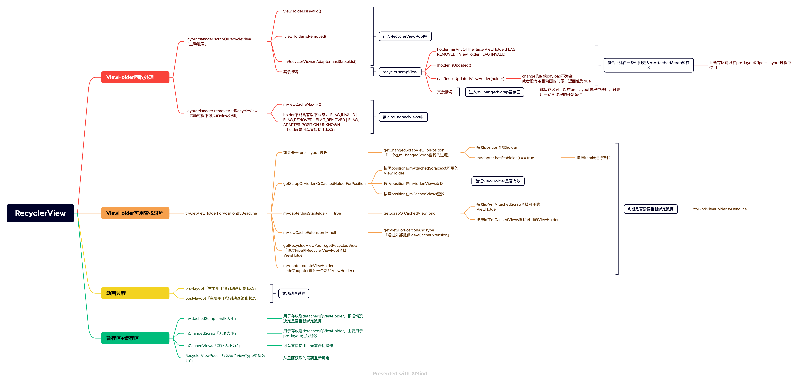

# RecyclerView 源码解析

### RecyclerView 基本组件

* LayoutManager：布局管理器
* Recycler: 复用ViewHolder
* Adapter: 数据转ViewHolder
* ChildHelper: 管理当前RecyclerView 的 Child View

### 简单工作原理图


### pre-layout 和 post-layout

RecyclerView 使用 pre-layout 和 post-layout 来获取动画前后状态

### RecyclerView暂存区/缓存区

* Recycler.mChangedScrap: 暂存已绘制的但将要改变的的ViewHolder，主要用于 pre-layout 中布局
* Recycler.mAttachedScrap: 暂存已绘制但非局部刷新标记的ViewHolder，在下次 onLayout 的时候，可以快速复用，无须 onCreateViewHolder， 但需要实际情况进行onBindViewHolder

  source：
    1. LinearLayoutManager.onLayoutChildren - detachAndScrapAttachedViews(recycler), 当 !
       viewHolder.isInvalid() 或者 viewHolder.isRemoved() 或者 mRecyclerView.mAdapter.hasStableIds()
       进入暂存区判断
    2. recycler.scrapView 根据 holder.isUpdated() 决定, 如果 holder.isUpdated() == true，则进入
       mChangedScrap，反之进入 mAttachedScrap

* Recycler.mCacheView: 缓存最近 detach 的 ViewHolder, 可以设置通过 Recycler.setViewCacheSize
  设置缓存大小，当位置相同的时候并且未发生变更，则可以快速复用

  source：RecyclerView.LayoutManager.(removeAndRecycleView/removeAndRecycleViewAt)

* Recycler.RecyclerViewPool：按照 ViewType为索引 缓存指定个数的ViewHolder，缓存已生成但detach的ViewHolder，使用的时候需要重新绑定数据

  source：CacheView超出cacheSize的条目 || holder.isUpdated() == true || holder.isRemoved() == true

use：RecyclerView.Recycler.tryGetViewHolderForPositionByDeadline



### 常见问题

1. 使用 notifyItemChanged() 不带 payloads参数，对应条目发生闪烁原因
    * 是因为ViewHolder 打上了 ViewHolder.FLAG_UPDATE，只会进入 changeScrap 暂存区
    * pre-layout 会从 changeScrap 取出 原ViewHolder A
    * post-layout 会从 attachScrap/cacheView/recyclerViewPool/adapter 中取出ViewHolder B
    * 但此时 ViewHolder A 和 ViewHolder B，不是同一个，则 ViewHolder A 进行淡出，ViewHolder B进行淡入，整体表现为闪烁

2. notifyItemChanged() 使用 payloads 不闪烁原因
    *
   从1可知，闪烁的原因是因为前后的ViewHolder不一致，那么如果能让前后ViewHolder一致，则不会闪烁[目的：让改变的ViewHolder进入 mAttachedScrap 区域]
    * 从 Recycler.scrapView(View view) 进入 mAttachedScrap区域判断可知，其中 canReuseUpdatedViewHolder(holder)
      是与 payloads
      相关的，整合内部条件 [ mItemAnimator == null || !payloads.isEmpty() || super.canReuseUpdatedViewHolder(viewHolder, payloads) ]
      可知，如果 payloads 不会空，则局部刷新就会进入 mAttachedScrap，最终得到 ViewHolder 一致

3. notifyDatasetChanged 为什么性能极差
    * 从下面分析，notifyDatasetChanged()的时候会清空CacheView，并把当前显示的view和cacheview中的viewholder设成
      FLAG_INVALID，导致每次布局都需要重新绑定数据
    * 在同类型的数目超出RecyclerViewPool默认大小的时候，还需要重新创建ViewHolder

```java
class RecyclerView {

    private class RecyclerViewDataObserver extends AdapterDataObserver {
        // notifyDataSetChanged() 最终调用的地方
        @Override
        public void onChanged() {
            assertNotInLayoutOrScroll(null);
            // 暂未发现使用的地方
            mState.mStructureChanged = true;
            /**
             * 1、mDispatchItemChangedEvent |= true => 这字段主要控制是否要分发 mLayout.onItemsChanged(this) 事件，LinearLayoutManager 暂未使用跳过
             * 2、mDataSetHasChangedAfterLayout = true => 用于标记数据是否完整改变
             * 3、markKnownViewsInvalid()
             *     3.1 当前正在显示的child view中的 ViewHolder 全部标记为 FLAG_UPDATE 和 FLAG_INVALID
             *     3.2 标记 childView 和 CacheView 中的 mInsetsDirty = true => 用于刷新 ItemDecoration 显示
             *     3.3 标记CacheView缓存的view中的 ViewHolder 全部标记为 FLAG_UPDATE 和 FLAG_INVALID，并根据 mAdapter == null || !mAdapter.hasStableIds() 来决定是否回收 CacheView中缓存的View 到 RecyclerViewPool 中
             */
            processDataSetCompletelyChanged(true);
            /**
             * 当前没有局部更新的内容，则刷新布局
             */
            if (!mAdapterHelper.hasPendingUpdates()) {
                // 此回调会触发布局刷新流程，会从走一次onMeasure+onLayout+onDraw
                requestLayout();
            }
        }
    }

    /**
     * 主要测量自身的宽高
     * @param widthSpec
     * @param heightSpec
     */
    @Override
    protected void onMeasure(int widthSpec, int heightSpec) {
        // ...
        // LinearLayoutManager为true
        if (mLayout.isAutoMeasureEnabled()) {
            // 测量RecyclerView自身的宽高
            final int widthMode = MeasureSpec.getMode(widthSpec);
            final int heightMode = MeasureSpec.getMode(heightSpec);
            mLayout.onMeasure(mRecycler, mState, widthSpec, heightSpec);
            final boolean measureSpecModeIsExactly =
                    widthMode == MeasureSpec.EXACTLY && heightMode == MeasureSpec.EXACTLY;
            // 一般RecyclerView width 和 height 都是设置成MATCH_PARENT，所以为true
            if (measureSpecModeIsExactly || mAdapter == null) {
                return;
            }
            // ...
        } else {
            // ...
        }
    }

    /**
     * 测量RecyclerView childView
     */
    @Override
    protected void onLayout(boolean changed, int l, int t, int r, int b) {
        TraceCompat.beginSection(TRACE_ON_LAYOUT_TAG);
        dispatchLayout();
        TraceCompat.endSection();
        mFirstLayoutComplete = true;
    }

    void dispatchLayout() {
        // ...
        mState.mIsMeasuring = false;
        if (mState.mLayoutStep == State.STEP_START) {
            dispatchLayoutStep1();
            mLayout.setExactMeasureSpecsFrom(this);
            dispatchLayoutStep2();
        } else if (mAdapterHelper.hasUpdates() || mLayout.getWidth() != getWidth()
                || mLayout.getHeight() != getHeight()) {
            // First 2 steps are done in onMeasure but looks like we have to run again due to
            // changed size.
            mLayout.setExactMeasureSpecsFrom(this);
            dispatchLayoutStep2();
        } else {
            // always make sure we sync them (to ensure mode is exact)
            mLayout.setExactMeasureSpecsFrom(this);
        }
        dispatchLayoutStep3();
    }

    /**
     * 布局的第一步
     * - 处理适配器更新
     * - 决定应该运行那个动画
     * - 保存当前view有关信息
     * - 如有必要，运行预测布局和保存它(预测布局)信息
     */
    private void dispatchLayoutStep1() {
        // ...
        mViewInfoStore.clear();     // mViewInfoStore重置，主要用来保留有关用于动画的视图的数据
        onEnterLayoutOrScroll();
        processAdapterUpdatesAndSetAnimationFlags();    // 处理适配器更新和设置动画标志
        saveFocusInfo();            // 保存焦点信息
        // 能够运行简单动画 && 局部刷新的时候
        mState.mTrackOldChangeHolders = mState.mRunSimpleAnimations && mItemsChanged;
        mItemsAddedOrRemoved = mItemsChanged = false;

        mState.mInPreLayout = mState.mRunPredictiveAnimations;
        mState.mItemCount = mAdapter.getItemCount();
        findMinMaxChildLayoutPositions(mMinMaxLayoutPositions);

        // 从 processAdapterUpdatesAndSetAnimationFlags() 推出是否支持 运行简单动画 
        if (mState.mRunSimpleAnimations) {
            // Step 0: Find out where all non-removed items are, pre-layout
            int count = mChildHelper.getChildCount();
            for (int i = 0; i < count; ++i) {
                final ViewHolder holder = getChildViewHolderInt(mChildHelper.getChildAt(i));
                // holder.shouldIgnore()[默认情况永为false] || ( holder.isInvalid()不可用 && !mAdapter.hasStableIds() )
                if (holder.shouldIgnore() || (holder.isInvalid() && !mAdapter.hasStableIds())) {
                    continue;
                }
                // 目前只记录当前holder的[left、top、right、bottom]
                final ItemHolderInfo animationInfo = mItemAnimator
                        .recordPreLayoutInformation(mState, holder,
                                ItemAnimator.buildAdapterChangeFlagsForAnimations(holder),
                                holder.getUnmodifiedPayloads());
                // holder 与 animationInfo绑定一起[Holder,InfoRecord(preInfo=info && flags |= FLAG_PRE)]
                mViewInfoStore.addToPreLayout(holder, animationInfo);
                // 局部change的时候
                if (mState.mTrackOldChangeHolders && holder.isUpdated() && !holder.isRemoved()
                        && !holder.shouldIgnore() && !holder.isInvalid()) {
                    // mAdapter.hasStableIds() ? holder.getItemId() : holder.mPosition;
                    long key = getChangedHolderKey(holder);
                    mViewInfoStore.addToOldChangeHolders(key, holder);
                }
            }
        }

        // 如果执行预测性动画[notifyDatasetChanged永为false]
        if (mState.mRunPredictiveAnimations) {
            // Step 1: run prelayout: This will use the old positions of items. The layout manager
            // is expected to layout everything, even removed items (though not to add removed
            // items back to the container). This gives the pre-layout position of APPEARING views
            // which come into existence as part of the real layout.

            // Save old positions so that LayoutManager can run its mapping logic.
            saveOldPositions();
            final boolean didStructureChange = mState.mStructureChanged;
            mState.mStructureChanged = false;
            // temporarily disable flag because we are asking for previous layout
            mLayout.onLayoutChildren(mRecycler, mState);
            mState.mStructureChanged = didStructureChange;

            for (int i = 0; i < mChildHelper.getChildCount(); ++i) {
                final View child = mChildHelper.getChildAt(i);
                final ViewHolder viewHolder = getChildViewHolderInt(child);
                if (viewHolder.shouldIgnore()) {
                    continue;
                }
                if (!mViewInfoStore.isInPreLayout(viewHolder)) {
                    int flags = ItemAnimator.buildAdapterChangeFlagsForAnimations(viewHolder);
                    boolean wasHidden = viewHolder
                            .hasAnyOfTheFlags(ViewHolder.FLAG_BOUNCED_FROM_HIDDEN_LIST);
                    if (!wasHidden) {
                        flags |= ItemAnimator.FLAG_APPEARED_IN_PRE_LAYOUT;
                    }
                    final ItemHolderInfo animationInfo = mItemAnimator.recordPreLayoutInformation(
                            mState, viewHolder, flags, viewHolder.getUnmodifiedPayloads());
                    if (wasHidden) {
                        recordAnimationInfoIfBouncedHiddenView(viewHolder, animationInfo);
                    } else {
                        mViewInfoStore.addToAppearedInPreLayoutHolders(viewHolder, animationInfo);
                    }
                }
            }
            // we don't process disappearing list because they may re-appear in post layout pass.
            clearOldPositions();
        } else {
            clearOldPositions();
        }

        onExitLayoutOrScroll();
        stopInterceptRequestLayout(false);
        mState.mLayoutStep = State.STEP_LAYOUT;
    }

    /**
     * 消费适配器更新 和 计算我们想要运行的动画类型
     * 此方法可能只处理更新的预布局状态或全部。
     */
    private void processAdapterUpdatesAndSetAnimationFlags() {
        if (mDataSetHasChangedAfterLayout) {
            // mAdapterHelper 主要处理更新局部更新，对于全局更新来说是没有意义的，则重置
            mAdapterHelper.reset();
            if (mDispatchItemsChangedEvent) {
                // 对于LinearLayout没有实际意义
                mLayout.onItemsChanged(this);
            }
        }

        // 支持预测性动画,当上述 mDataSetHasChangedAfterLayout  == true的时候，是不会执行的，因为 reset()所有
        if (predictiveItemAnimationsEnabled()) {
            mAdapterHelper.preProcess();
        } else {
            // 跳过预处理并一次性应用所有更新
            mAdapterHelper.consumeUpdatesInOnePass();
        }

        /**
         * 局部更新动画[局部更新分为4种：新增，删除、移动、改变]
         * mItemsChanged： 当有条目改变的时候
         * mItemsAddedOrRemoved: 当有条目新增、删除、移动的时候为true
         */
        boolean animationTypeSupported = mItemsAddedOrRemoved || mItemsChanged;

        /**
         * 1、布局完成
         * 2、支持ItemAnimator
         * 3、(全局刷新 || 动画类型支持 || LayoutManager请求简单动画)
         * 4、(不是全局刷新 || mAdapter.hasStableIds() == true)
         */
        mState.mRunSimpleAnimations = mFirstLayoutComplete
                && mItemAnimator != null
                && (mDataSetHasChangedAfterLayout || animationTypeSupported || mLayout.mRequestedSimpleAnimations)
                && (!mDataSetHasChangedAfterLayout || mAdapter.hasStableIds());

        /**
         * 1、支持简单动画
         * 2、局部刷新(从上述可知，如果是局部刷新则true)
         * 3、不是全局刷新
         * 4、支持预测性动画
         */
        mState.mRunPredictiveAnimations = mState.mRunSimpleAnimations
                && animationTypeSupported
                && !mDataSetHasChangedAfterLayout
                && predictiveItemAnimationsEnabled();
    }

    /**
     * 布局的第二步
     * 我们对最终状态的视图进行实际布局。如有必要（例如测量），此步骤可能会运行多次。
     */
    private void dispatchLayoutStep2() {
        // ...
        mAdapterHelper.consumeUpdatesInOnePass();
        mState.mItemCount = mAdapter.getItemCount();
        mState.mDeletedInvisibleItemCountSincePreviousLayout = 0;

        // Step 2: Run layout
        mState.mInPreLayout = false;
        // 最后会到 Recycler.getViewForPosition(int position) 中
        mLayout.onLayoutChildren(mRecycler, mState);

        mState.mStructureChanged = false;
        mPendingSavedState = null;

        // onLayoutChildren may have caused client code to disable item animations; re-check
        mState.mRunSimpleAnimations = mState.mRunSimpleAnimations && mItemAnimator != null;
        mState.mLayoutStep = State.STEP_ANIMATIONS;
        // ...
    }

    /**
     * 布局最后一步
     * 我们保存有关动画视图的信息，触发动画并进行任何必要的清理。
     */
    private void dispatchLayoutStep3() {
        // ...
        mState.mLayoutStep = State.STEP_START;

        // 动画处理
        if (mState.mRunSimpleAnimations) {
            for (int i = mChildHelper.getChildCount() - 1; i >= 0; i--) {
                ViewHolder holder = getChildViewHolderInt(mChildHelper.getChildAt(i));
                if (holder.shouldIgnore()) {
                    continue;
                }
                long key = getChangedHolderKey(holder);
                // 当前的animationInfo
                final ItemHolderInfo animationInfo = mItemAnimator
                        .recordPostLayoutInformation(mState, holder);
                // 获取原key(position/itemId)的Holder
                ViewHolder oldChangeViewHolder = mViewInfoStore.getFromOldChangeHolders(key);
                // 存在原viewHolder
                if (oldChangeViewHolder != null && !oldChangeViewHolder.shouldIgnore()) {
                    final boolean oldDisappearing = mViewInfoStore.isDisappearing(
                            oldChangeViewHolder);
                    final boolean newDisappearing = mViewInfoStore.isDisappearing(holder);
                    if (oldDisappearing && oldChangeViewHolder == holder) {
                        // run disappear animation instead of change
                        mViewInfoStore.addToPostLayout(holder, animationInfo);
                    } else {
                        // oldDisappearing = false || oldChangeViewHolder != holder
                        final ItemHolderInfo preInfo = mViewInfoStore.popFromPreLayout(oldChangeViewHolder);
                        mViewInfoStore.addToPostLayout(holder, animationInfo);
                        ItemHolderInfo postInfo = mViewInfoStore.popFromPostLayout(holder);

                        if (preInfo == null) {
                            handleMissingPreInfoForChangeError(key, holder, oldChangeViewHolder);
                        } else {
                            animateChange(oldChangeViewHolder, holder, preInfo, postInfo,
                                    oldDisappearing, newDisappearing);
                        }
                    }
                } else {
                    mViewInfoStore.addToPostLayout(holder, animationInfo);
                }
            }

            // Step 4: Process view info lists and trigger animations
            mViewInfoStore.process(mViewInfoProcessCallback);
        }

        // 回收 mAttachedScrap -> RecyclerViewPool
        mLayout.removeAndRecycleScrapInt(mRecycler);

        // 重置变量
        mState.mPreviousLayoutItemCount = mState.mItemCount;
        mDataSetHasChangedAfterLayout = false;
        mDispatchItemsChangedEvent = false;
        mState.mRunSimpleAnimations = false;
        mState.mRunPredictiveAnimations = false;
        mLayout.mRequestedSimpleAnimations = false;

        // 清空 ChangedScrap
        if (mRecycler.mChangedScrap != null) {
            mRecycler.mChangedScrap.clear();
        }
        // ...
    }
}
```

```java
public final class Recycler {
    final ArrayList<ViewHolder> mAttachedScrap = new ArrayList<>();
    ArrayList<ViewHolder> mChangedScrap = null;

    final ArrayList<ViewHolder> mCachedViews = new ArrayList<ViewHolder>();
    RecycledViewPool mRecyclerPool;

    @NonNull
    public View getViewForPosition(int position) {
        return getViewForPosition(position, false);
    }

    View getViewForPosition(int position, boolean dryRun) {
        return tryGetViewHolderForPositionByDeadline(position, dryRun, FOREVER_NS).itemView;
    }

    ViewHolder tryGetViewHolderForPositionByDeadline(int position, boolean dryRun, long deadlineNs) {
        // ...
        boolean fromScrapOrHiddenOrCache = false;
        ViewHolder holder = null;

        // 0) 如果是pre-layout过程，根据 position | id(mAdapter.hasStableIds()开启的时候) 从 mChangedScrap 查找viewholder
        if (mState.isPreLayout()) {
            holder = getChangedScrapViewForPosition(position);
            fromScrapOrHiddenOrCache = holder != null;
        }

        // 1) 据 position从 mAttachedScrap || hiddenList || mCacheView 中查找viewHolder
        if (holder == null) {
            holder = getScrapOrHiddenOrCachedHolderForPosition(position, dryRun);
            // ...
        }

        if (holder == null) {
            final int offsetPosition = mAdapterHelper.findPositionOffset(position);
            if (offsetPosition < 0 || offsetPosition >= mAdapter.getItemCount()) {
                throw new IndexOutOfBoundsException("Inconsistency detected. Invalid item "
                        + "position " + position + "(offset:" + offsetPosition + ")."
                        + "state:" + mState.getItemCount() + exceptionLabel());
            }

            final int type = mAdapter.getItemViewType(offsetPosition);
            // 2) 使用 stable ids 去 scrap 和 cache 查找 ViewHolder
            if (mAdapter.hasStableIds()) {
                holder = getScrapOrCachedViewForId(mAdapter.getItemId(offsetPosition), type, dryRun);
                if (holder != null) {
                    // update position
                    holder.mPosition = offsetPosition;
                    fromScrapOrHiddenOrCache = true;
                }
            }
            // ..

            // 3) 根据type类型 从RecyclerViewPool中获取ViewHolder
            if (holder == null) { // fallback to pool
                if (DEBUG) {
                    Log.d(TAG, "tryGetViewHolderForPositionByDeadline("
                            + position + ") fetching from shared pool");
                }
                holder = getRecycledViewPool().getRecycledView(type);
                if (holder != null) {
                    holder.resetInternal();
                    if (FORCE_INVALIDATE_DISPLAY_LIST) {
                        invalidateDisplayListInt(holder);
                    }
                }
            }

            // 4) 根据type类型 创建一个新的ViewHolder
            if (holder == null) {
                long start = getNanoTime();
                if (deadlineNs != FOREVER_NS
                        && !mRecyclerPool.willCreateInTime(type, start, deadlineNs)) {
                    // abort - we have a deadline we can't meet
                    return null;
                }
                holder = mAdapter.createViewHolder(RecyclerView.this, type);
                if (ALLOW_THREAD_GAP_WORK) {
                    // only bother finding nested RV if prefetching
                    RecyclerView innerView = findNestedRecyclerView(holder.itemView);
                    if (innerView != null) {
                        holder.mNestedRecyclerView = new WeakReference<>(innerView);
                    }
                }

                long end = getNanoTime();
                mRecyclerPool.factorInCreateTime(type, end - start);
                if (DEBUG) {
                    Log.d(TAG, "tryGetViewHolderForPositionByDeadline created new ViewHolder");
                }
            }
        }

        if (fromScrapOrHiddenOrCache && !mState.isPreLayout() && holder
                .hasAnyOfTheFlags(ViewHolder.FLAG_BOUNCED_FROM_HIDDEN_LIST)) {
            holder.setFlags(0, ViewHolder.FLAG_BOUNCED_FROM_HIDDEN_LIST);
            if (mState.mRunSimpleAnimations) {
                int changeFlags = ItemAnimator
                        .buildAdapterChangeFlagsForAnimations(holder);
                changeFlags |= ItemAnimator.FLAG_APPEARED_IN_PRE_LAYOUT;
                final ItemHolderInfo info = mItemAnimator.recordPreLayoutInformation(mState,
                        holder, changeFlags, holder.getUnmodifiedPayloads());
                recordAnimationInfoIfBouncedHiddenView(holder, info);
            }
        }

        boolean bound = false;
        if (mState.isPreLayout() && holder.isBound()) {
            // do not update unless we absolutely have to.
            holder.mPreLayoutPosition = position;
        } else if (!holder.isBound() || holder.needsUpdate() || holder.isInvalid()) {
            if (DEBUG && holder.isRemoved()) {
                throw new IllegalStateException("Removed holder should be bound and it should"
                        + " come here only in pre-layout. Holder: " + holder
                        + exceptionLabel());
            }
            final int offsetPosition = mAdapterHelper.findPositionOffset(position);
            // mAdapter 绑定数据
            bound = tryBindViewHolderByDeadline(holder, offsetPosition, position, deadlineNs);
        }

        final ViewGroup.LayoutParams lp = holder.itemView.getLayoutParams();
        final LayoutParams rvLayoutParams;
        if (lp == null) {
            rvLayoutParams = (LayoutParams) generateDefaultLayoutParams();
            holder.itemView.setLayoutParams(rvLayoutParams);
        } else if (!checkLayoutParams(lp)) {
            rvLayoutParams = (LayoutParams) generateLayoutParams(lp);
            holder.itemView.setLayoutParams(rvLayoutParams);
        } else {
            rvLayoutParams = (LayoutParams) lp;
        }
        rvLayoutParams.mViewHolder = holder;
        rvLayoutParams.mPendingInvalidate = fromScrapOrHiddenOrCache && bound;
        return holder;
    }
}
```

4. 怎样提高 notifyDatasetChanged 性能
    1. 从上述3.3可知，当mAdapter.hasStablesIds() == true的时候，不进行回收CacheView
    2. 从 LayoutManager.scrapOrRecycleView 可知，当 mAdapter.hasStablesIds() == true, 都会进入 mAttachedScrap
       区域

   结论：从 tryGetViewHolderForPositionByDeadline 可知，设置 mAdapter.setHasStableIds(true) 的时候，是可以使用itemId从
   mAttachedScrap 和 CacheView 获取 ViewHolder，减少 mAdapter 创建ViewHolder 和 绑定ViewHolder
   的成本，与局部刷新相比，性能并没有缺失

### RecyclerView 与 ListView 对比

1. 缓存内容从View -> ViewHolder，增加View的重用性，使复用成本降低
2. 将 getView 拆分成 onCreateViewHolder 和 onBindViewHolder, 可以操控更精细化
3. viewType可以不连续，RecyclerView是使用LongSpareArray，而ListView使用了数组
4. 制作动画简易， RecyclerView针对动画做了指定的接口，并使用 pre-layout 和 post-layout 获取动画前后状态
5. 增加了局部刷新，而无需全部更新
6. ListView第一级缓存效率很低，只有在无数据变更情况下触发了onLayout才能使用，而RecyclerView的第一级缓存mCacheView是记录最近退出的view【源码地方】
7. 不同RecyclerView可以使用同一个RecyclerViewPool，减少内存损耗
8. 缓存策略修改，提高击中缓存区的概率，增加缓存的重用性 (mAttachedScrap/mChangedScrap) -> mCacheViews -> RecyclerViewPool ->
   Adapter.onCreateViewHolder
9. 可以自由调整 mCacheViews 和 RecyclerView Pool大小，增加在不同场景的性能