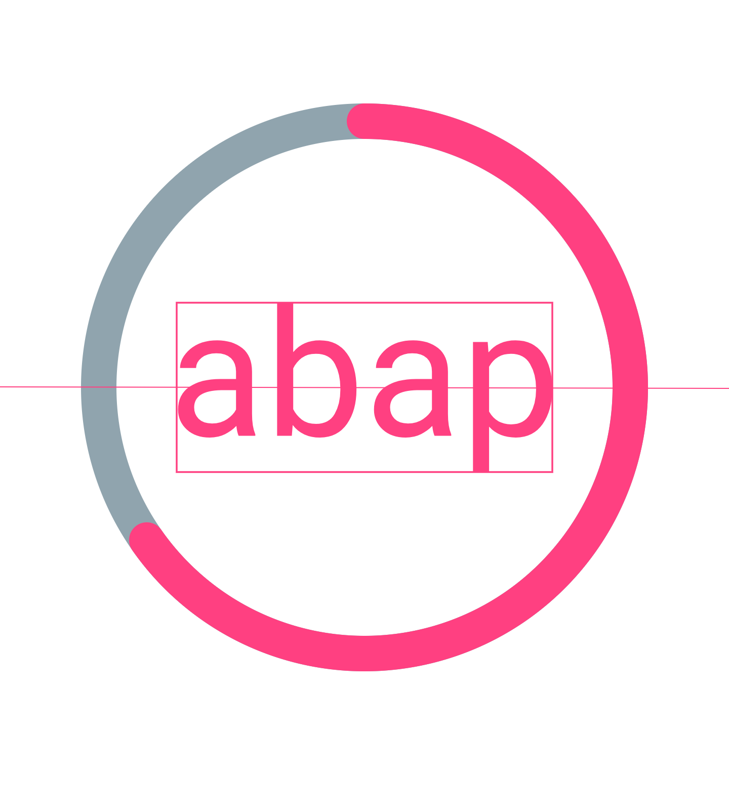
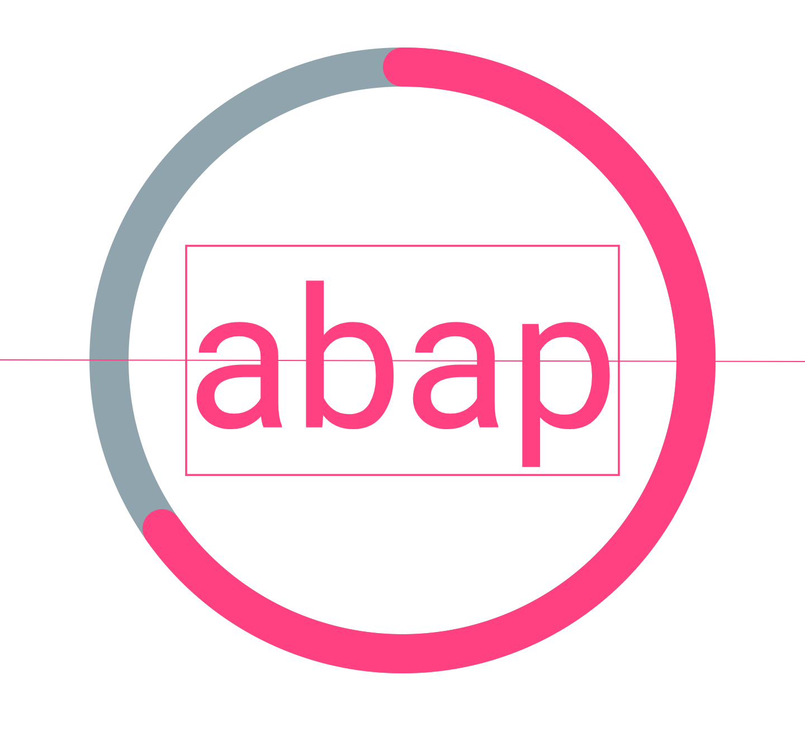
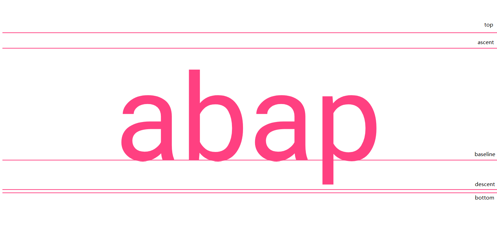
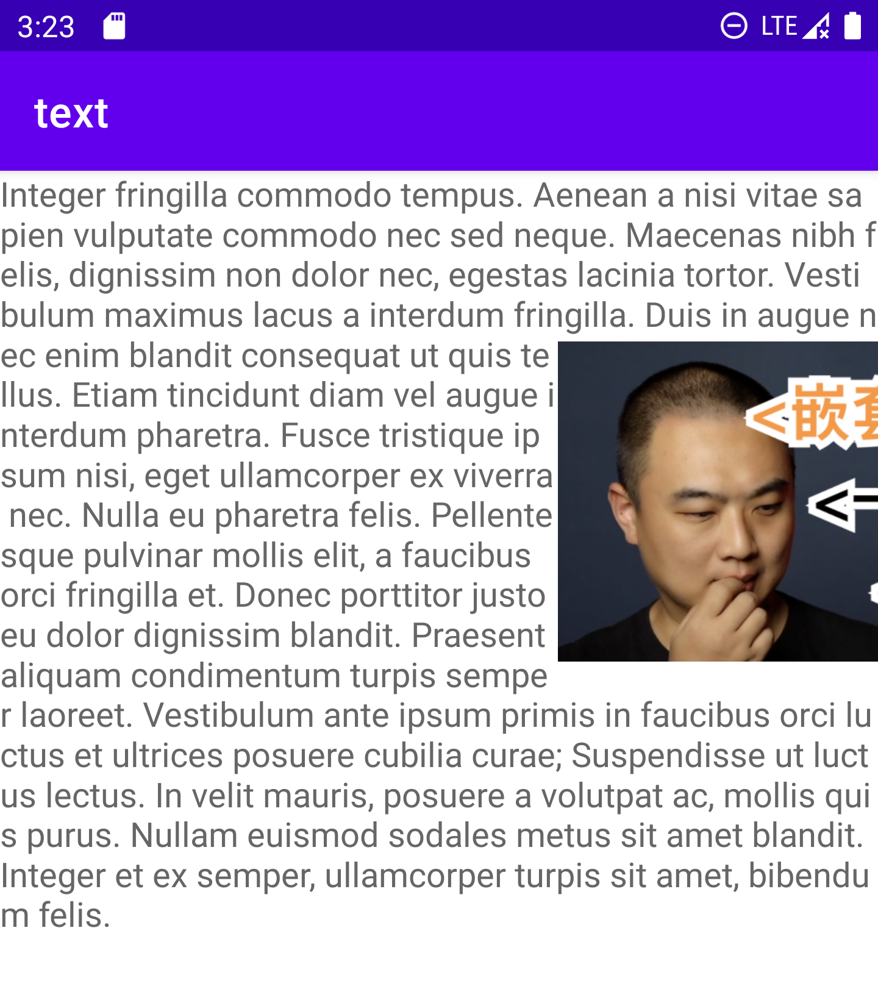
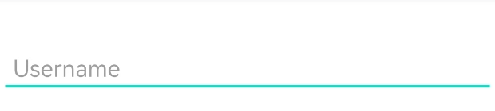

# 文字的绘制

### [文本居中](./src/main/java/com/zxj/text/view/RichTextView.kt)
1. Text严格居中, getTextBounds() 获取目前文字的整体宽高，但添加文字可能会导致整体跳动，不适合日常文字布局
    * 严格居中：

2. Text准线居中, 因为基于paint.fontMetrics(这是跟字体和字体大小有关)，只添加文字的时候不会导致paint.fontMetrics改变，适合日常文字布局
    * 示例准线居中: 
   
    * 准线如下： 
   
    * Tip: 关于Text居中公式：height / 2f - (bounds.top + bounds.bottom) / 2f，我当初想了很久为什么是+，而不是-，因为我没有使用坐标的思维去思考
      1. bounds.top 和 bounds.bottom 分别指文字top坐标和bottom坐标，所以求出中间坐标为 (top + bottom) / 2f
      2. baseline坐标 和 center(top+bottom)坐标为差值 - (top + bottom) / 2f，只要baseline下移差值即可，则最后得baseline坐标为  height / 2f + (-(top + bottom) / 2f)

### [图文混排](./src/main/java/com/zxj/text/view/RichTextView.kt)

技术点：
1. Paint.breakText 函数的应用

### [MaterialEditText](../materialedittext/src/main/java/com/zxj/materialedittext/view/MaterialEditTextView.kt)

技术点：
1. 简单属性动画应用
2. 自定义属性原理
   * R.styleable.MaterialEditTextView 是个int类型的数组，包含属性的id，在当前例子等价于intArrayOf(R.attr.useFloatingLabel)
   * R.styleable.MaterialEditTextView_useFloatingLabel 是个int的值，是在上一个数组的索引，在当前例子等价于 0 
