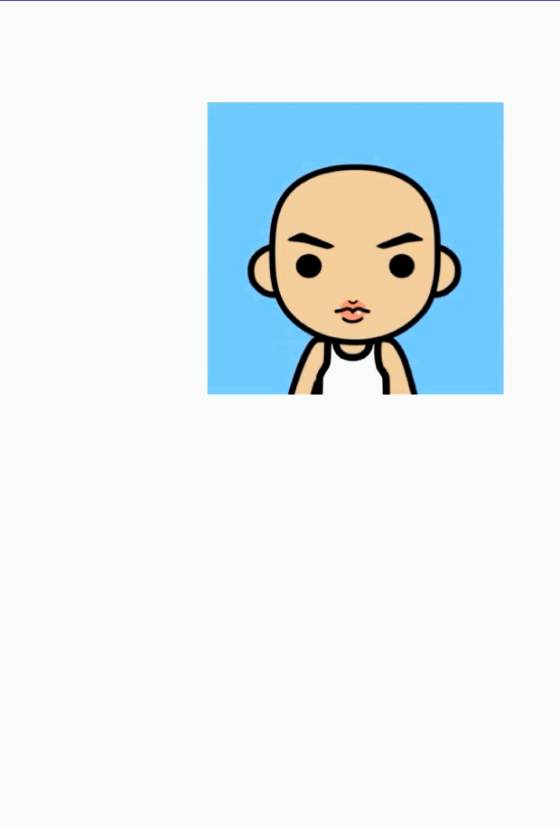

# View touch

### View的拖拽

1. [ViewDragHelper(应用内拖拽)](./src/main/java/com/zxj/touch/drag/DragBlockView.kt)
   

2. [OnDragListener(应用间拖拽)](./src/main/java/com/zxj/touch/drag/fragment/DragTransportFragment.kt)

### 多点触控类型

扔老师总结多点触控为三种类型：

1. [接力型](./src/main/java/com/zxj/touch/multitouch/RelayView.kt): 新手指 承接 老手指 的职责

   

   Tip: 当有新手指加入的时候，新手指抢过控制权，当新手指抬起，控制权重新回到原手指上；


2. [合作型](./src/main/java/com/zxj/touch/multitouch/CooperationView.kt): 多手指互相配合

   

   Tip: 一只手指全速运行；一只手指在下，一只手指在下，半速运行；

3. [各自为战型](./src/main/java/com/zxj/touch/multitouch/SelfView.kt): 每个手指都有独立的职责

   

   Tip: 每个手指都是一直画笔，可以独立绘制路线；

### [简易ViewPager](./src/main/java/com/zxj/touch/viewgroup/ZViewPager.kt)

* 技术点
    1. VelocityTracker：用于计算速度
    2. OverScroller：滚动帮助类

    

### [ScalableImageView](./src/main/java/com/zxj/touch/scalable/ScalableActivity.kt)

* 技术点
    1. OverScroller：滚动帮助类
    2. GestureDetectorCompat：手势检测器[双击，滑动，惯性滑动等]
    3. ScaleGestureDetector：缩放手势检测器

    

### ViewGroup.dispatchTouchEvent解析

* mFirstTouchTarget: TouchTarget链表，主要包含 当前响应事件的 child view 和 手指id，使用头插法维护，最早加入的在链表的最后
* ACTION_DOWN 为整体事件序列的开始，ACTION_UP 为整体事件序列的结束
* mGroupFlags & FLAG_DISALLOW_INTERCEPT != 0：主要用于处理不同方向的滑动冲突，禁止父类拦截事件，相关函数
  ViewParent.requestDisallowInterceptTouchEvent()
* actionIndex会随着手指的抬起和按下改变而改变，pointerId则不会，所以可以标识唯一id

```java
public class ViewGroup {

    @Override
    public boolean dispatchTouchEvent(MotionEvent ev) {

        // ...

        boolean handled = false;
        if (onFilterTouchEventForSecurity(ev)) {
            final int action = ev.getAction();
            final int actionMasked = action & MotionEvent.ACTION_MASK;

            // step1: ACTION_DOWN 初期重置所有 touch状态，防止因 ACTION_CANCEL 和 ACTION_UP 未调用导致的异常信息，起保护作用 
            if (actionMasked == MotionEvent.ACTION_DOWN) {
                cancelAndClearTouchTargets(ev);
                resetTouchState();
            }


            final boolean intercepted;
            // step2: 如果 当前是action_down事件 或者 存在 child view 响应事件的时候,
            if (actionMasked == MotionEvent.ACTION_DOWN || mFirstTouchTarget != null) {
                // 查询是否被child view设置不可拦截
                final boolean disallowIntercept = (mGroupFlags & FLAG_DISALLOW_INTERCEPT) != 0;
                if (!disallowIntercept) {
                    intercepted = onInterceptTouchEvent(ev);
                    // 恢复action，防止被 onInterceptTouchEvent 修改
                    ev.setAction(action);
                } else {
                    intercepted = false;
                }
            } else {
                // 能达到此分支
                // 1. 事件本身就是ViewGroup处理
                // 2. 当前ViewGroup在当前事件序列拦截过，且未被父布局拦截
                intercepted = true;
            }
            // ...


            // 检查当前ViewGroup在当前事件序列是否被取消了
            final boolean canceled = resetCancelNextUpFlag(this) || actionMasked == MotionEvent.ACTION_CANCEL;
            // 手指触摸状态下恒false
            final boolean isMouseEvent = ev.getSource() == InputDevice.SOURCE_MOUSE;
            // 该标志主要用于判断是否支持多指的事件序列，在android 3.0的时候默认支持
            final boolean split = (mGroupFlags & FLAG_SPLIT_MOTION_EVENTS) != 0 && !isMouseEvent;
            // 用于存放当前子View的touchTarget
            TouchTarget newTouchTarget = null;
            // 用于判断是否产生了新的TouchTarget
            boolean alreadyDispatchedToNewTouchTarget = false;


            // step3: 在非取消或者拦截情况下，查找 TouchTarget
            if (!canceled && !intercepted) {

                // newTouchTarget的查找只会发生在 ACTION_DOWN 和 ACTION_POINTER_DOWN 中
                if (actionMasked == MotionEvent.ACTION_DOWN
                        || (split && actionMasked == MotionEvent.ACTION_POINTER_DOWN)
                        || actionMasked == MotionEvent.ACTION_HOVER_MOVE) {

                    // 得到手指唯一id
                    final int actionIndex = ev.getActionIndex();
                    final int idBitsToAssign = split ? 1 << ev.getPointerId(actionIndex) : TouchTarget.ALL_POINTER_IDS;

                    // 预防性重置, 当前的手指id，正常情况下是没有的
                    removePointersFromTouchTargets(idBitsToAssign);

                    // 遍历当前所有子view，查找TouchTarget
                    final int childrenCount = mChildrenCount;
                    if (newTouchTarget == null && childrenCount != 0) {
                        final float x = isMouseEvent ? ev.getXCursorPosition() : ev.getX(actionIndex);
                        final float y = isMouseEvent ? ev.getYCursorPosition() : ev.getY(actionIndex);
                        // 根据指定优先级，默认是倒叙遍历
                        final ArrayList<View> preorderedList = buildTouchDispatchChildList();
                        final boolean customOrder = preorderedList == null && isChildrenDrawingOrderEnabled();
                        final View[] children = mChildren;
                        for (int i = childrenCount - 1; i >= 0; i--) {
                            final int childIndex = getAndVerifyPreorderedIndex(childrenCount, i, customOrder);
                            final View child = getAndVerifyPreorderedView(preorderedList, children, childIndex);

                            // 如果当前手指都不在此view的范围了则直接跳过
                            if (!child.canReceivePointerEvents() || !isTransformedTouchPointInView(x, y, child, null)) {
                                continue;
                            }

                            // 用当前child在mFirstTouchTarget链表查找
                            newTouchTarget = getTouchTarget(child);
                            // newTouchTarget来源1：不为空，则证明之前点击过，可以节省 dispatchTransformedTouchEvent() 过程，添加当前手指id
                            if (newTouchTarget != null) {
                                newTouchTarget.pointerIdBits |= idBitsToAssign;
                                break;
                            }

                            // 预防性操作
                            resetCancelNextUpFlag(child);
                            // 询问child view是否能处理当前事件
                            if (dispatchTransformedTouchEvent(ev, false, child, idBitsToAssign)) {
                                mLastTouchDownTime = ev.getDownTime();
                                if (preorderedList != null) {
                                    for (int j = 0; j < childrenCount; j++) {
                                        if (children[childIndex] == mChildren[j]) {
                                            mLastTouchDownIndex = j;
                                            break;
                                        }
                                    }
                                } else {
                                    mLastTouchDownIndex = childIndex;
                                }
                                mLastTouchDownX = ev.getX();
                                mLastTouchDownY = ev.getY();
                                // newTouchTarget来源2：当前子view能够处理当前事件，添加一个TouchTarget记录状态
                                newTouchTarget = addTouchTarget(child, idBitsToAssign);
                                alreadyDispatchedToNewTouchTarget = true;
                                break;
                            }
                            // ...
                        }
                        // ...
                    }

                    // newTouchTarget来源3：一种特殊情况, 主要用于多指，如果点击范围没有找到可用子view，但存在其他child view点击，则交给最早进入的child处理
                    if (newTouchTarget == null && mFirstTouchTarget != null) {
                        newTouchTarget = mFirstTouchTarget;
                        while (newTouchTarget.next != null) {
                            newTouchTarget = newTouchTarget.next;
                        }
                        newTouchTarget.pointerIdBits |= idBitsToAssign;
                    }
                }
            }


            // step4: 事件分发，这里可以解释为什么ACTION_DOWN对应child view处理，后续事件都交给对应child view 处理[不拦截过程中]
            if (mFirstTouchTarget == null) {
                // 没有childView响应，则自身尝试处理事件 
                handled = dispatchTransformedTouchEvent(ev, canceled, null, TouchTarget.ALL_POINTER_IDS);
            } else {
                TouchTarget predecessor = null;
                TouchTarget target = mFirstTouchTarget;
                while (target != null) {
                    final TouchTarget next = target.next;
                    if (alreadyDispatchedToNewTouchTarget && target == newTouchTarget) {
                        handled = true;
                    } else {
                        final boolean cancelChild = resetCancelNextUpFlag(target.child) || intercepted;
                        // 使用当前事件[带了事件手指id] 和 touchTarget记录的pointerIdBits 比较做事件分发处理
                        if (dispatchTransformedTouchEvent(ev, cancelChild, target.child, target.pointerIdBits)) {
                            handled = true;
                        }
                        // 处理cancel时间的touchTarget
                        if (cancelChild) {
                            if (predecessor == null) {
                                mFirstTouchTarget = next;
                            } else {
                                predecessor.next = next;
                            }
                            target.recycle();
                            target = next;
                            continue;
                        }
                    }
                    predecessor = target;
                    target = next;
                }
            }


            // step5: 根据指定状态重置相关资源
            if (canceled || actionMasked == MotionEvent.ACTION_UP || actionMasked == MotionEvent.ACTION_HOVER_MOVE) {
                // 重置当前当前ViewGroup的touch状态
                resetTouchState();
            } else if (split && actionMasked == MotionEvent.ACTION_POINTER_UP) {
                final int actionIndex = ev.getActionIndex();
                final int idBitsToRemove = 1 << ev.getPointerId(actionIndex);
                // 当前手指抬起，清空此手指对应标志
                removePointersFromTouchTargets(idBitsToRemove);
            }
        }

        // ...
        return handled;
    }

}

```